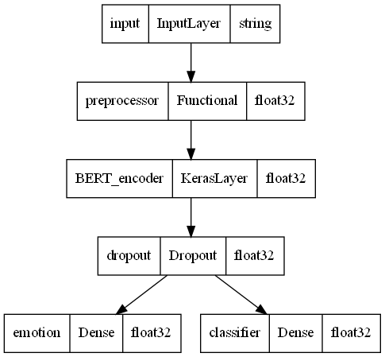
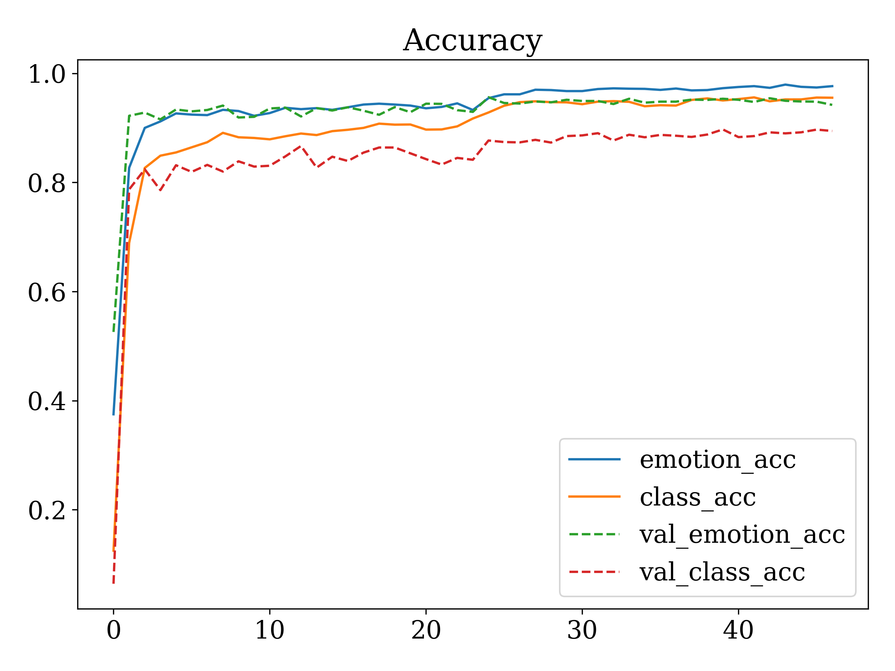
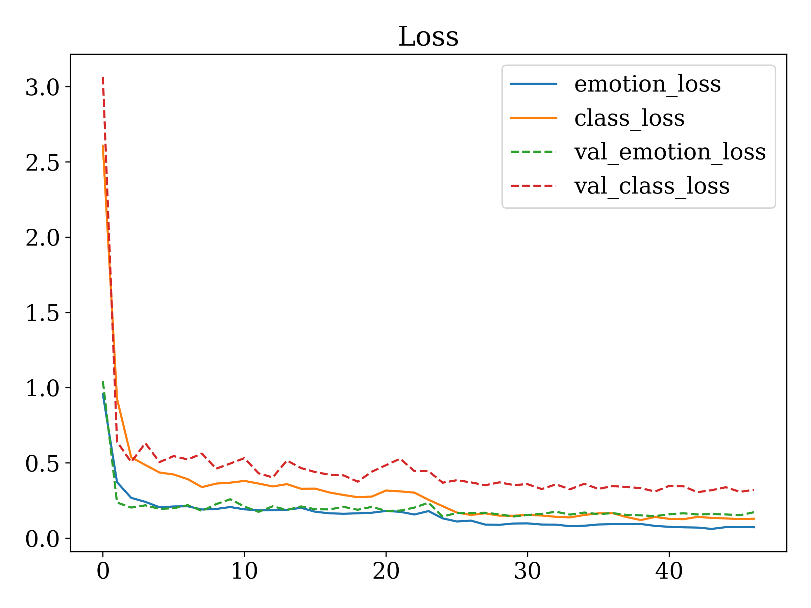

# Bert-Chinese-Text-Classifier-Tensorflow2
## Tensorflow2 - 基于Bert的文本分类模型

中文商品评论分类，基于Bert模型，TensorFlow2.

### 环境

```
Python 3.9.x
TensorFlow 2.9.2
tqdm
numpy
matplotlib
pandas
```

### 中文商品数据集

使用由[jinhuakst](https://github.com/SophonPlus/ChineseNlpCorpus/commits?author=jinhuakst)整理的[ChineseNlpCorpus](https://github.com/SophonPlus/ChineseNlpCorpus)中的两个数据集，分别作为训练集与测试集：

1. [online_shopping_10_cats](https://github.com/SophonPlus/ChineseNlpCorpus/blob/master/datasets/online_shopping_10_cats/intro.ipynb)：10种类别，总共62773条数据，其中正向评论：31727条，负向评论：31046条.
2. [yf_amazon](https://github.com/SophonPlus/ChineseNlpCorpus/blob/master/datasets/yf_amazon/intro.ipynb)(亚马逊数据集)：总共有720万条评论，从中筛选出和上述十个类别中的商品评论，作为测试集.

该模型的输出包含评论的情感与分类两个，将第一个数据集进行3:1划分为训练集与验证集（由于每种类别的商品数目不同如下表，我还将每种类别的商品评论进行了补全到7500）：

|  类别  | 总数目 | 正例 | 负例 |
| :----: | :----: | :--: | :--: |
|  书籍  |  3851  | 2100 | 1751 |
|  平板  | 10000  | 5000 | 5000 |
|  手机  |  2323  | 1165 | 1158 |
|  水果  | 10000  | 5000 | 5000 |
| 洗发水 | 10000  | 5000 | 5000 |
| 热水器 |  574   | 474  | 100  |
|  蒙牛  |  2033  | 992  | 1041 |
|  衣服  | 10000  | 5000 | 5000 |
| 计算机 |  3992  | 1996 | 1996 |
|  酒店  | 10000  | 5000 | 5000 |

最终训练集与验证集大小为

|     数据集     | 数据量 |
| :------------: | :----: |
|     训练集     | 75000  |
|     验证集     | 15691  |
| 测试集(Amazon) | 67863  |

**注：**由于Amazon数据集中有部分类别缺失：水果，蒙牛，衣服，酒店. 剩余的类别中每种类别随机选取15000条评论，并将4分及以上作为正向评论，2分即以下作为负向评论（3分评论舍去）.

### 模型下载

Tensorflow中Bert模型分为两个部分，可以从Tensorflow-Hub中下载，链接为[bert_zh_preprocess](https://tfhub.dev/tensorflow/bert_zh_preprocess/3)和[bert_zh_L-12_H-768_A-12](https://tfhub.dev/tensorflow/bert_zh_L-12_H-768_A-12/4)，分别为预处理模型（句子分词和）和bert模型.

模型导入方法我是将两个模型分别下载到本地的 `./model/bert_preprocessor `和`./model/bert_encoder`中，由于GitHub的上传文件大小限制，无法上传bert模型，只能够自己去下然后解压到这两个文件夹中. 每个目录都是以下两个文件、两个文件夹：

- keras_metadata.pb
- saved_model.pb
- /assets/
- /variables/

使用`keras.utils.plot_model(classifier_model, show_dtype=True)`显示模型架构图：



### 代码执行

每个代码具体功能如下（执行`main.py`后，会生成`acc.png, loss.png`两个训练过程准确率和损失的变化图）

```python
# 训练模型
python main.py
# 测试模型
python validation_amazon.py
# Jupyter Notebook 文件，用于本地查看、划分数据集、调试训练代码，上面两个代码直接部署到服务器上训练
main.ipynb, validate.ipynb
```

### 模型训练结果

`batch=32, epochs=1, SeqLength=128, dropout=0.3` 的训练数据变化图



训练集与验证集上尝试三种模型的准确率如下所示（左侧为**情感分类准确率**、右侧为**商品分类准确率**）：

| 模型参数                                    | 训练集      | 验证集        | 测试集(Amazon) |
| ------------------------------------------- | ----------- | ------------- | -------------- |
| batch=32,epochs=2,SeqLength=128,dropout=0.1 | 96.6%,94.8% | 93.99%,90.59% | 77.75%,79.55%  |
| batch=32,epochs=1,SeqLength=128,dropout=0.3 | 94.4%,91.9% | 93.67%,88.62% | 73.95%,84.04%  |
| batch=32,epochs=2,SeqLength=128,dropout=0.3 | 97.8%,94.2% | 94.57%,90.63% | 78.74%,81.75%  |
| batch=16,epochs=2,SeqLength=256,dropout=0.3 | 95.7%,94%   | 93.26%,89.45% | 76.38%,83.71%  |

### 自定义测试数据

在 `validate.ipynb` 中，可以自行输入测试数据，使用已经训练好的模型进行预测（已训练好的模型会保存到 `ckp_save_handle` 目录中），模型导入方式 `classifier_model.load_weights('模型权重路径')`，结果返回情感判别和排名前三的预测结果，以下是一些测试结果：

```python
"写的真好，期待后续出版"：1，[('书籍', 3.49), ('平板', 1.51), ('洗发水', 1.24)]
"这几本确实都很不错"：1，[('书籍', 3.74), ('平板', 1.2), ('水果', 1.17)]
"烧水速度真快"：0，[('热水器', 6.39), ('酒店', 4.44), ('平板', 0.8)]
"有点悬念外，其他内容都很空洞"：0，[('书籍', 7.54), ('水果', -0.11), ('酒店', -0.2)]
"缺少对人物的心理活动描写"：0，[('书籍', 2.68), ('洗发水', 1.38), ('平板', 1.28)]
"这书送的也太慢了"：0，[('书籍', 6.83), ('平板', 0.74), ('洗发水', 0.18)]
"运行速度太快了，非常好"：1，[('平板', 5.66), ('计算机', 1.09), ('手机', 1.09)]
"华为系统挺好"：1，[('平板', 7.69), ('手机', 1.64), ('热水器', 0.03)]
"适合看视屏用"：1，[('平板', 6.31), ('手机', 3.5), ('计算机', -0.39)]
"小米的也很好用"：1，[('平板', 7.32), ('手机', 2.78), ('热水器', 0.91)]
"垃圾，自带的软件都删不掉"：0，[('平板', 5.82), ('手机', 0.74), ('洗发水', 0.49)]
"根本连不上wifi"：0，[('平板', 4.08), ('酒店', 3.99), ('手机', 0.51)]
"玩两天王者就卡了，根本操作不起来"：0，[('平板', 7.63), ('手机', 2.08), ('洗发水', -0.34)]
"机身太大了，打电话没声音"：0，[('手机', 6.11), ('平板', 5.71), ('计算机', 0.59)]
"电池根本用不了几天"：0，[('手机', 5.71), ('平板', 5.45), ('计算机', 1.59)]
"好"：1，[('热水器', 7.06), ('手机', 3.07), ('平板', 2.3)]
"原来卖4000现在卖1000块，太坑人了吧？"：0，[('水果', 4.59), ('洗发水', 2.53), ('平板', 2.21)]
"很好打折后只要100块，血赚"：1，[('平板', 3.27), ('水果', 2.94), ('洗发水', 2.14)]
"真的甜，好吃!"：1，[('水果', 8.46), ('平板', 2.03), ('洗发水', 0.54)]
"烟台的苹果真好"：1，[('水果', 7.29), ('平板', 2.0), ('手机', -0.01)]
"发过来全烂了"：0，[('水果', 5.83), ('衣服', 2.12), ('洗发水', 1.27)]
"个头太小了吧，塞牙缝都不够"：0，[('水果', 7.85), ('平板', 0.44), ('洗发水', 0.33)]
"这东西都放了多久，都是烂的，这也敢卖"：0，[('水果', 7.53), ('洗发水', 1.24), ('平板', 0.48)]
"一盒能用一个月，真好用"：1，[('平板', 4.45), ('洗发水', 3.17), ('水果', 0.99)]
"用了后顺滑多了，头发也没油了"：0，[('洗发水', 6.69), ('酒店', 0.55), ('衣服', 0.41)]
"和沐浴露加起来10块，真好"：1，[('洗发水', 5.67), ('酒店', 1.41), ('平板', 0.88)]
"两瓶合起来50，太便宜了"：1，[('洗发水', 6.78), ('酒店', 1.15), ('衣服', 0.84)]
"用来洗头真不错"：1，[('洗发水', 5.86), ('平板', 2.21), ('衣服', 1.07)]
"cpu太慢了吧"：0，[('平板', 5.72), ('手机', 3.65), ('计算机', 1.07)]
"键盘发过来就是个坏的"：0，[('手机', 4.83), ('平板', 4.46), ('计算机', 3.7)]
"这自带的杀毒软件把自己整垮了"：0，[('计算机', 4.21), ('平板', 3.42), ('手机', -0.18)]
"性价比很高，三星的内存条速度很快"：1，[('平板', 5.04), ('手机', 3.16), ('计算机', 1.34)]
"位置不错离景点蛮近的，早餐也很好吃"：1，[('酒店', 7.77), ('水果', 1.23), ('平板', 0.37)]
"房子虽然不大，但是很精细，服务也很好"：1，[('酒店', 8.01), ('平板', 0.36), ('水果', -0.13)]
"除了没有浴缸和保险柜，其他都很好"：1，[('酒店', 8.12), ('平板', 0.43), ('水果', -0.15)]
"什么破地方，连个wifi都没有"：0，[('平板', 3.76), ('酒店', 3.02), ('水果', -0.1)]
"餐饮真的差，又贵又难吃"：0，[('酒店', 9.02), ('水果', 1.06), ('平板', -0.34)]
"靠近马路，隔音效果太差，根本睡不着"：0，[('酒店', 10.62), ('平板', -0.26), ('计算机', -1.02)]
"尺码太小了，穿的很不舒服"：0，[('衣服', 9.66), ('洗发水', -0.31), ('水果', -0.39)]
"蒙牛真的垃圾!"：0，[('蒙牛', 8.03), ('衣服', 2.66), ('平板', -0.04)]
"蒙牛的新包装不错"：1，[('蒙牛', 10.87), ('衣服', 0.82), ('酒店', 0.01)]
"在平板上买的洗发水很好用"：1，[('平板', 6.82), ('洗发水', 0.81), ('手机', 0.26)]
"平板上订的酒店，比手机上订的贵"：0，[('酒店', 9.19), ('平板', 0.96), ('水果', -1.05)]
"衣服上印的手机很好看"：0，[('衣服', 9.55), ('平板', 0.02), ('手机', -0.65)]
"酒店里的平板很慢"：0，[('平板', 4.54), ('酒店', 4.49), ('手机', -0.72)]
"酒店里的平板比我手机慢"：0，[('平板', 6.64), ('酒店', 1.61), ('手机', 0.46)]
"这衣服搭配平板比搭配手机漂亮"：1，[('衣服', 8.12), ('平板', 2.76), ('水果', -0.22)]
```

